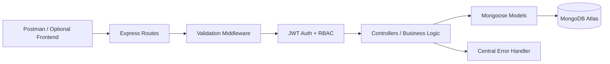
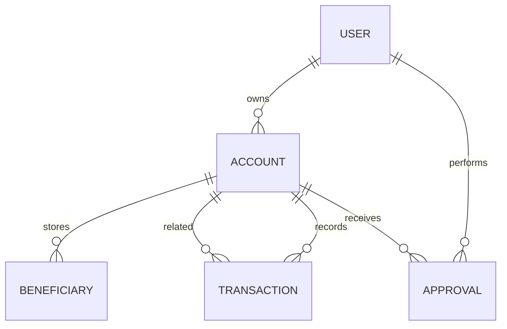

# Architecture

```mermaid
flowchart LR
    P[Postman / Optional Frontend] --> R[Express Routes]
    R --> V[Validation Middleware]
    V --> A[JWT Auth + RBAC]
    A --> C[Controllers / Business Logic]
    C --> M[Mongoose Models]
    M --> DB[(MongoDB Atlas)]
    C --> E[Central Error Handler]
```

```mermaid
erDiagram
    USER ||--o{ ACCOUNT : owns
    USER ||--o{ APPROVAL : performs
    ACCOUNT ||--o{ BENEFICIARY : stores
    ACCOUNT ||--o{ TRANSACTION : records
    ACCOUNT ||--o{ APPROVAL : receives
    ACCOUNT ||--o{ TRANSACTION : related
```
